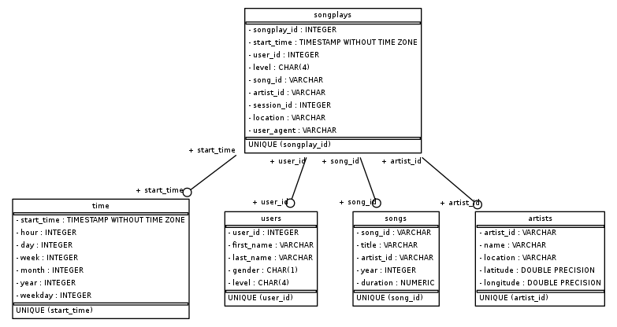

# Project: Data Modeling with Postgres

## Objective

In this project, we present a solution to address the analytical requirements of a fictional startup called 'Sparkify'. 

## Introduction
This startup 'Sparkify' wants to examine the information they've been gathering on songs and user behaviour on their brand-new music streaming service. Their analytics team is very curious to know which music users are listening to. They now lack a simple means to query their data, which is stored in directories containing JSON logs on user activity on the app and JSON information on the songs in their app.

We present a Postgres database with tables designed to optimize queries on song play analysis. 

## Project Description
In this project, we defined fact and dimension tables for a star schema for a particular analytic focus. We wrote ETL pipeline that transfers data from files in two local directories into these tables in Postgres using Python and SQL.

## Database Description

The database comes with 5 tables - 4 dimensional and 1 fact table.

| **Table Name** |  **Type** |                                **Description**                               |
|:--------------:|:---------:|:----------------------------------------------------------------------------:|
|     `users`    | dimension |               Contains information about users who played songs              |
|     `songs`    | dimension |              Contains information about songs in music database              |
|    `artists`   | dimension |             Contains information about artists in music database             |
|     `time`     | dimension | Contains information of time when a song was played in specific broken units |
|   `songplays`  |    fact   |                 Contains log data associated with song plays                 |

This design fulfills all the analytical needs as all queries can be run on `songplays` table itself. Since we do not have any joins, the queries will run fast.

## File Structure

|   **File Name**  |                                                                                              **Description**                                                                                             |
|:----------------:|:--------------------------------------------------------------------------------------------------------------------------------------------------------------------------------------------------------:|
|       data       |                                                                              This folder contains data for songs and logs.                                                                               |
| create_tables.py |                                                                            This script creates fresh tables in the Postgres DB                                                                           |
|     etl.ipynb    | This file reads and processes a single file from song_data and  log_data and loads the data into your tables. This notebook contains   detailed instructions on the ETL process for each of the tables.  |
|      etl.py      |                                                     This file reads and processes files from song_data  and log_data and loads them into your tables.                                                    |
|  sql_queries.py  |                                                        This file contains all your sql queries,  and is imported into the last three files above.                                                        |
|     README.md    |                                                                                      Information about the project.                                                                                      |

## How to run Python scripts
1. Run following line to make tables.

> `python create_tables.py`

2. Run below query to run the ETL pipeline.

> `python etl.py`

